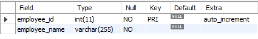

# Finals Lab Task 1. MySQL Basics
With this activity in this lesson it tackled the use of MySQL Workbench and using of one of its servers to write and execute by making different classifications to create specified tables and an entity relationship diagram/s where it was focused on a multi-level company details.

Given tasks from our Instructor:

Task 1: Create the employees table
- Define employee_id as a unique integer, auto-increment, and primary key.
- Define employee_name as a VARCHAR (up to 255 characters), and make it not null.
- Define manager_id as an integer, which will be a foreign key referencing employee_id from the same table.

Task 2: Create the departments table
- Define department_id as a unique integer, auto-increment, and primary key.
- Define department_name as a VARCHAR (up to 255 characters), and make it not null.

Task 3: Create the employee_departments table
- Define employee_id as an integer, which will be a foreign key referencing employee_id in the employees table.
- Define department_id as an integer, which will be a foreign key referencing department_id in the departments table.
  Set a composite primary key on the combination of employee_id and department_id.

Task 4: Create the employee_projects table
- Define employee_id as an integer, which will be a foreign key referencing employee_id in the employees table.
- Define project_name as a VARCHAR (up to 255 characters), and make it not null.

Task 5: Create the managers table
- Define manager_id as a unique integer, auto-increment, and primary key.
- Define employee_id as an integer, which will be a foreign key referencing employee_id in the employees table.

## Query Statements
- **Task 1** : Create a table named employees with following fields:

- **Task 2** : Create a table named departments with following fields:

- **Task 3** : Create a table named employee_departments with following fields:

- **Task 4** : Create a table named employee_projects with following fields:

- **Task 5** : Create a table named managers with following fields:

## Table Structures
* **Task 1: Employee Table Structure**

- **Task 2: Departments Table Structure**

- **Task 3: Employee Departments Table Structure**

- **Task 4: Employee Projects Table Structure**

- **Task 5: Employee Managers Table Structure**

## Entity-Relational Schema
- Attached image of the diagram below

